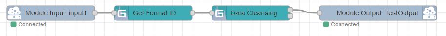

# node-red-datacleansing

## 目次
* [概要](#概要)
* [機能](#機能)
* [Deployment 設定値](#deployment-設定値)
  * [環境変数](#環境変数)
  * [Create Option](#create-option)
* [ログ出力内容](#ログ出力内容)
  * [get-format-id](#get-format-id)
  * [data-cleansing](#data-cleansing)
  * [format-info](#format-info)
* [Node Specification](#node-specification)
  * [get-format-id](#Node-Specification-get-format-id)
  * [data-cleansing](#Node-Specification-data-cleansing)
  * [format-info](#Node-Specification-format-info)
* [Feedback](#feedback)
* [LICENSE](#license)

## 概要
node-red-datacleansingは、下記処理を行うNode-REDのカスタムノードです。

#### 1. get-format-number

&emsp;* GAUDI標準メッセージデータからフォーマット番号部分に相当する部分を抽出して、メッセージにセットする。

#### 2. set-format-info

&emsp;* フォーマット番号に相当するフォーマット情報をメッセージにセットする。

#### 3. data-cleansing

&emsp;* メッセージデータをフォーマット情報に従ってフィルタリング・変換を行う。

## 機能

入力データの抽出・変換を行う機能。<br>
以下のノードを含む。

* get-format-id GAUDI 標準メッセージの先頭レコードの RecordHeader からフォーマットID相当部分（"\_"でワード分解した２ワード目）を抽出する。
* data-cleansing メッセージに付与されたフォーマット情報を元に入力データのクレンジング（フィルタリング／変換）を行う。
* format-info フォーマットIDとそれに対応するフォーマット情報を設定するグローバル設定ノード。

※ フォーマット情報の詳細については以降の [format-info](#format-info) に記載<br>

入力データに対するフォーマット情報の付与とクレンジング処理を下記のようなシンプルなフローで実装可能<br>


## Deployment 設定値

### 環境変数

#### 環境変数の値

(なし)

### Create Option

#### Create Option の値

(なし)

## ログ出力内容

### get-format-id

| LogLevel | 出力概要 |
| -------- | -------- |
| error    | フォーマット番号取得失敗     |
| warn     | 無し        |
| info     | メッセージ[受信/送信] |
| debug    | プロパティ・フォーマット番号    |
| trace    | メソッドの開始・終了・離脱<br>受信メッセージプロパティ<br>送信メッセージ       |

### data-cleansing

| LogLevel | 出力概要 |
| -------- | -------- |
| error    | クレンジング例外発生     |
| warn     | 無し        |
| info     | テンポラリーフォルダー削除[成功/失敗]<br>メッセージ[受信/送信]<br>クレンジング失敗<br>[プロパティ/メタキー/フォーマットId]が無い<br>ペイロードが配列ではない<br>フォーマット情報 |
| debug    | エラー変換処理オプション<br>トレースフラグ<br>再構築フラグ<br>アドインフォルダ再作成<br>フォーマット情報<br>pythonシェル    |
| trace    | メソッドの開始・終了・離脱<br>[受信/送信]メッセージ       |

### format-info

| LogLevel | 出力概要 |
| -------- | -------- |
| error    | フォーマット情報タイプ不正<br>フォーマット情報取得失敗     |
| warn     | 無し        |
| info     | 無し |
| debug    | フォーマット情報<br>OutputDataが配列か    |
| trace    | メソッドの開始・終了<br>取り出しフォーマット情報       |

## Node Specification

<a id="Node-Specification-get-format-id"></a>

### get-format-id

- 機能概要

  GAUDI 標準メッセージの先頭レコードの RecordHeader からフォーマットID相当部分（"\_"でワード分解した２ワード目）を抽出する。

- プロパティ

  

  | プロパティ | Type         | Required | Description                                                                                                    |
  | ---------- | ------------ | -------- | -------------------------------------------------------------------------------------------------------------- |
  | 名前       | string       |          | ノードの表示名を設定                                                                                           |
  | 入力       | msg.         | ○        | GAUDI 標準メッセージ形式データを保持する msg オブジェクト下の要素名を指定                                      |
  | 出力       | msg./metaKey | ○        | フォーマットIDの設定先<br>msg.: msg オブジェクト下の要素に設定<br>メタキー（メッセージプロパティ）として設定 |

- エラー／例外

  以下の場合、メッセージ受信時に例外を発行する。

  - ノードプロパティに未設定の項目がある場合。
  - "入力"に指定したメッセージプロパティが GAUDI 標準メッセージ形式でない場合。
  - メッセージの先頭レコードの RecordHeader からフォーマットID相当部分が抽出できない場合（"\_"分割できない場合）。

- 使用例１

  [プロパティ]

  | プロパティ | Type    | Value   |
  | ---------- | ------- | ------- |
  | 入力       | msg.    | payload |
  | 出力       | metaKey | format  |

  [入力メッセージ]

  ```json
  {
    "payload": {"RecordList":[{"RecordHeader":["012_034_InputFile.xlsx"], "RecordData":["1", "2", "3"]}]}
  }
  ```

  [出力メッセージ]

  ```json
  {
    "payload": {"RecordList":[{"RecordHeader":["012_034_InputFile.xlsx"], "RecordData":["1", "2", "3"]}]},
    "properties": {"PropertyList":[{"key":"format", "value":"034"}]}
  }
  ```

- 使用例２

  [プロパティ]

  | プロパティ | Type | Value   |
  | ---------- | ---- | ------- |
  | 入力       | msg. | payload |
  | 出力       | msg. | format  |

  [入力メッセージ]

  ```json
  {
    "payload": {"RecordList":[{"RecordHeader":["012_034_InputFile.xlsx"], "RecordData":["1", "2", "3"]}]}
  }
  ```

  [出力メッセージ]

  ```json
  {
    "payload": {"RecordList":[{"RecordHeader":["012_034_InputFile.xlsx"], "RecordData":["1", "2", "3"]}]},
    "format": "034"
  }
  ```

<a id="Node-Specification-data-cleansing"></a>

### data-cleansing

- 機能概要

  メッセージに付与されたフォーマット情報を元に入力データのクレンジング（フィルタリング／変換）を行う。

- プロパティ

  

  | プロパティ               | Type            | Required | Description                                                                                                                                                     |
  | ------------------------ | --------------- | -------- | --------------------------------------------------------------------------------------------------------------------------------------------------------------- |
  | 名前                     | string          |          | ノードの表示名を設定する。                                                                                                                                      |
  | 入力                     | msg./GAUDI msg. | ○       | クレンジング対象データ<br>msg.: msg オブジェクト下の要素の配列データを対象とする。<br>GAUDI msg.: msg オブジェクト下の要素の GAUDI 標準形式データを対象とする。 |
  | 入力(フォーマットID)     | msg./metaKey    | ○       | フォーマット情報から引き当てするフォーマットIDを設定する。                                                                                                    |
  | フォーマット情報         | format-info     | ○       | 引き当てするフォーマット情報のグローバル設定を選択。<br>プロパティの詳細は、 [format-info](#format-info) を参照。                                               |
  | ユーザ定義変換関数リスト | list            |          | ユーザ定義の変換関数のリスト                                                                                                                                    |
  | &nbsp; 関数名            | string          | ○       | ユーザ定義変換関数名を指定。<br>フォーマット情報に記述する関数名を記載。<br>Python コード側に同名の関数を定義する必要がある。                                   |
  | &nbsp; 関数説明          | string          |          | ユーザ定義変換関数の説明文を記載する。                                                                                                                          |
  | &nbsp; Python コード     | python          | ○       | ユーザ定義変換関数の Python コードを記述する。<br>詳細は、「ユーザ定義変換関数要求仕様」を参照。                                                                |
  | 変換エラー処理           | option          | ○       | 変換に失敗したデータが存在する場合の出力方法を選択する。<br>[データカラムに埋め込み, レコードをエラー出力, メッセージをエラー出力]<br>詳細は、「変換エラー処理仕様」を参照。|
  | トレース                 | checkbox        |          | 詳細ログを出力2に出力する。                                                                                                                                     |

- 使用可能な変換関数

  | 論理名                         | 物理名               | エイリアス名(廃止予定)             | 機能                                                                                                                                                                                 | 入力                                                               | オプション                                                                                                                                                                                                                                                                                                                  |
  | ------------------------------ | ------------------- | ------------------ | ------------------------------------------------------------------------------------------------------------------------------------------------------------------------------------ | ------------------------------------------------------------------ | --------------------------------------------------------------------------------------------------------------------------------------------------------------------------------------------------------------------------------------------------------------------------------------------------------------------------- |
  | 日時データ結合                 | UnionDate            |                     | 入力の３データをそれぞれ、int 変換 →byte 分割 → 再連結した後に年月・日時・分秒のデータとして連結した日時データ文字列にする。<br>出力形式は、"YYYY/MM/DD hh:mm:ss"の形式となる。      | [0]~[2]:２バイト INT                                       | なし                                                                                                                                                                                                                                                                                                                        |
  | 日時データ結合\_swap           | UnionDateSwap        |                     | 入力の３データをそれぞれ、int 変換 →byte 分割 →swap→ 再連結した後に年月・日時・分秒のデータとして連結した日時データ文字列にする。<br>出力形式は、"YYYY/MM/DD hh:mm:ss"の形式となる。 | [0]~[2]:２バイト INT                                       | なし                                                                                                                                                                                                                                                                                                                        |
  | 日時データ結合\_12 桁形式       | UnionDateF12         |                     | 入力の３データをそれぞれ、int 変換 →byte 分割 → 再連結した後に年月・日時・分秒のデータとして連結した日時データ文字列にする。<br>出力形式は、"YYMMDDhhmmss"の形式となる。             | [0]~[2]:２バイト INT                                       | なし                                                                                                                                                                                                                                                                                                                        |
  | 日時データ結合\_12 桁形式 swap  | UnionDateF12Swap     |                     | 入力の３データをそれぞれ、byte 分割 →swap 再連結した後に年月・日時・分秒のデータとして連結した日時データ文字列にする。<br>出力形式は、"YYMMDDhhmmss"の形式となる。                   | [0]~[2]:２バイト INT                                       | なし                                                                                                                                                                                                                                                                                                                        |
  | 日付データ書式変換              | DateFormat           |                     | 入力の日付形式文字列を日付データに変換後、指定された書式の文字列に再変換する。（Date2DateF12 の下位関数）<br>※ fff部は、マイクロ秒として取り込み、出力する。                                                                            | [ 日付形式文字列 ]<br>"YYYY/MM/DD hh:mm:ss.fff"形式                | [ 変換書式 ]<br>変換書式： Python の書式形式で指定。省略可能。<br>デフォルト＝"%y%m%d%H%M%S"                                                                                                                                                                                                                                |
  | 日付データ書式変換\_12 桁形式   | Date2DateF12         |                     | 入力の日付形式文字列を日付データに変換後、"YYMMDDhhmmss"の形式の文字列に再変換する。                                                                                                 | [ 日付形式文字列 ]<br>"YYYY/MM/DD hh:mm:ss.fff"形式                | なし                                                                                                                                                                                                                                                                                                                        |
  | ISO時刻形式変換                | NativeTimeToISOTime  |                     | タイムゾーン情報を持たない非ISO形式日時文字列をオプションで指定したタイムゾーンの時刻値と書式に変換する。<br>%z出力による時差表記部分は、基本的に"+0000"の形式となる。（"+00:00"の形式ではない）<br>出力データタイムゾーンにUTCを指定した場合、時差表記は、"+0000"ではなく、"Z"となる。  | 非ISO形式日時文字列（タイムゾーン情報なし）                | [入力データタイムゾーン, 入力データフォーマット, 出力データタイムゾーン, 出力データフォーマット]<br>&nbsp; [0]: 入力データタイムゾーン<br>&nbsp; [1]: 入力データフォーマット（Pythonフォーマット形式。例："%Y-%m-%d %H:%M:%S.%f"）<br>&nbsp; [2]: 出力データタイムゾーン（省略可能。デフォルト＝"UTC"）<br>&nbsp; [3]: 出力データフォーマット（Pythonフォーマット形式。省略可能。デフォルト＝"%Y-%m-%dT%H:%M:%S.%f%z"） |
  | 書式変換                       | Format               |                    | 入力データ配列をオプションで指定した書式に変換して文字列化する。										                                                                                                  | [0]~[N]:数値・文字列                                                                | [ 変換書式 ]<br>変換書式： Pythonの書式形式で指定。<br>※推奨の書式：{:書式}を入力の配列データを順にセット<br>※Python書式に従うが、インデックス指定時は０オリジンの為、注意が必要。                                                                                                                       |
  | 単位変換                       | Operation            |                     | 入力データと Options 配列の先頭データを float 変換し、掛け合わせたものを出力する。                                                                                                   | INT                                                                | [変換倍率]<br>変換倍率：入力に掛け合わせる数値。                                                                                                                                                                                                                                                                            |
  | 除算                          | Division             |                     | 10進データをオプションの除数で除算する。                                                                                                                                          | 数値                                                                | [除数]       |
  | 最大値取得                     | Max                  |                     | 入力データ列から最大値を取得する。                                                                                                                                               | [ 数値配列 ]                                                         | なし       |
  | 最小値取得                     | Min                  |                     | 入力データ列から最小値を取得する。                                                                                                                                               | [ 数値配列 ]                                                         | なし       |
  | 上位・下位バイト入れ替え        | Swap                 |                     | 2byte16進データの上位・下位バイトを入れ替える。<br>４桁未満の場合は、前方を０埋めする。                                                                                         | １６進文字列（４桁）                                                         | なし       |
  | 固定値設定                     | SetValue             |                    | Options で指定された値を設定する。                                                                                                                                                   | なし                                                               | [設定値]                                                                                                                                                                                                                                                                                                                    |
  | フラグ反転                     | RevertFlag           |                    | 0/1 フラグを反転する。<br>（入力値が０の場合１を返し、それ以外は０を返す）                                                                                                           | BOOLEAN/INT                                                         | なし                                                                                                                                                                                                                                                                                                                        |
  | 10進(2byte)→2進変換            | DecToBit             |                    | 10進(2byte)データを2進データに変換。                                                                                                                                      | INT                                                        | なし                                                                                                                                                                                                                                                                                                                        |
  | 2進(1byte)→10進変換            | BitToDec             | bit_to_dec         | 2 進データを 10 進データに変換。（1byte 分）                                                                                                                                          | 2進数（文字列）                                                        | なし                                                                                                                                                                                                                                                                                                                        |
  | 16進(2byte)→10進変換           | HexToDec             |                    | 16 進データ(2byte)を 10 進データに変換。                                                                                                                                          | 16進数（文字列）                                                                | なし                                                                                                                                                                                                                                                                                                                        |
  | 10進→16進変換                  | DecToHex             | dec_to_hex         | 10 進データを 16 進データに変換。（2byte）                                                                                                                                            | ２バイト INT                                                                | なし                                                                                                                                                                                                                                                                                                                        |
  | 16進(2byte)→2進変換            | HexToBit             |                    | 16 進(2byte)データを2進データに変換。                                                                                                                                      | 16進数（文字列）                                    | なし                                                                                                                                                                                                                                                                                                                        |
  | 2進(1byte)→16進変換            | BitToHex             |                    | 2 進データを 16 進データに変換。（1byte 分）                                                                                                                                          | 2進数（文字列）                                                        | なし                                                                                                                                                                                                                                                                                                                        |
  | ID 計算                        | two_word_to_hour     |                    | 上位・下位 byte データを 16 進文字化後、連結して int(2byte)化、msec から hour 単位に変換。                                                                                           | [２バイト INT, ２バイト INT]                                                         | なし                                                                                                                                                                                                                                                                                                                        |
  | 文字連結                       | Join                 | join               | 文字のリストを連結し、１文字列にする。                                                                                                                                               | [ 文字配列 ]                                                       | [結合セパレータ]<br>結合セパレータ：連結する文字列間に挿入する文字。<br>省略時は、挿入しない。                                                                                                                                                                                                                              |
  | 文字列抽出                     | Substring            | substring          | 文字列から一部を抽出する。                                                                                                                                                           | 文字列                                                             | [抽出開始位置, 抽出文字数]<br>抽出開始位置：切り出し開始位置。（1 ～）<br>　　　　　　　負値の場合、文字列末端からの文字数となる。<br>　　　　　　　省略時は、1。<br>抽出文字数：切り出し文字数。（1 ～）<br>　　　　　　負値の場合、元文字列長と合算した値を抽出文字数とする。<br>　　　　　　省略時は、末尾まで切り出し。 |
  | 分割抽出                       | Split                | split              | 文字列を指定セパレータで分解し、指定位置のデータを抽出する。                                                                                                                         | 文字列                                                             | [セパレータ, 抽出位置]<br>セパレータ：文字の分解に使用する文字。省略不可。<br>抽出位置：分解した文字列の配列から抜き出す位置。（1 ～）                                                                                                                                                                                      |
  | スペース除去                   | Trim                 | trim               | 入力文字列全体のスペースを除去。                                                                                                                                                     | 文字列                                                             | なし                                                                                                                                                                                                                                                                                                                        |
  | バイト分割数値文字列化         | change_normal        |                     | int 変換 →byte 分割 → 再連結（文字列）                                                                                                                                               | INT                                                                | なし                                                                                                                                                                                                                                                                                                                        |
  | バイト分割数値文字列化 swap    | change_normal_swap   |                     | int 変換 →byte 分割 →byte スワップ → 再連結（文字列）                                                                                                                                | INT                                                                | なし                                                                                                                                                                                                                                                                                                                        |
  | コードキー生成                 | CodeKey              |                    | 入力の１～３番目のデータをそれぞれ、int 変換 →byte 分割 → 再連結し、全てのデータを文字列として連結する。                                                                             | [0]: INT<br>[1]~[3]:２バイト INT<br>[4]: INT | なし                                                                                                                                                                                                                                                                                                                        |
  | コードキー生成\_swap           | CodeKeySwap          |                    | 入力の１～３番目のデータをそれぞれ、int 変換 →byte 分割 →swap→ 再連結し、全てのデータを文字列として連結する。                                                                        | [0]: INT<br>[1]~[3]:２バイト INT<br>[4]: INT | なし                                                                                                                                                                                                                                                                                                                        |

- ユーザ定義変換関数要求仕様

  - 引数１

    変換対象入力データ。
    フォーマット情報の入力インデックス数が１の場合は単独データ、
    フォーマット情報の入力インデックス数が２以上の場合は配列データが入力される。

  - 引数２

    変換オプションデータ。
    フォーマット情報の Options で指定された変換オプションデータが渡される。
    Options に指定されているデータの件数が１の場合は単独データ、２以上の場合は配列データで入力される。

  - 戻り値

    変換結果を返す。

  - 関数イメージ

    ```python
      # 入力文字列を","で区切り、options番目のデータを抽出
      def MyConverter(input, options):
        return input.split(',')[options-1]
    ```

- 変換エラー処理仕様

  変換に失敗したデータが存在する場合、指定したオプションに従いメッセージに出力する。<br>変換に失敗したデータのインデックス配列をconverrorindexプロパティにセットする。

  - データカラムに埋め込み
 
    出力１:変換に成功したデータと失敗したデータを出力する<br>出力２:なし<br>

    [入力メッセージ]

    ```json
    {
      "payload": [["1,2,3","4,5,6"],["A,B,C","D,E,F"]],
      "format": "034"
    }
    ```

    [出力１のメッセージ]

    ```json
    {
      "payload": [
        ["2", "6"],
        ["B", <エラー情報>]
      ],
      "format": "034",
      "converrorindex": [1]
    }
    ```

    [出力２のメッセージ]

    なし
    
  - レコードをエラー出力
 
    出力１:変換に成功したデータを出力する<br>出力２:変換に失敗したデータを出力する<br>

    [入力メッセージ]

    ```json
    {
      "payload": [["1,2,3","4,5,6"],["A,B,C","D,E,F"]],
      "format": "034"
    }
    ```

    [出力１のメッセージ]

    ```json
    {
      "payload": [
        ["2", "6"]
      ],
      "format": "034",
      "converrorindex": []
    }
    ```

    [出力２のメッセージ]

    ```json
    {
      "payload": [
        ["B", <エラー情報>]
      ],
      "format": "034",
      "converrorindex": [0]
    }
    ```

  - メッセージをエラー出力

    - 変換が全て成功した場合

      出力１:変換に成功したデータを出力する<br>出力２:なし

      [入力メッセージ]

      ```json
      {
        "payload": [["1,2,3","4,5,6"],["A,B,C","D,E,F"]],
        "format": "034"
      }
      ```

      [出力１のメッセージ]

      ```json
      {
        "payload": [
          ["2", "6"],
          ["B", "F"]
        ],
        "format": "034",
        "converrorindex": []
      }
      ```

      [出力２のメッセージ]

      なし

    - 変換に失敗したデータが1つ以上存在する場合

      出力１:なし<br>出力２:変換に成功したデータと失敗したデータを出力する

      [入力メッセージ]

      ```json
      {
        "payload": [["1,2,3","4,5,6"],["A,B,C","D,E,F"]],
        "format": "034"
      }
      ```

      [出力１のメッセージ]

      なし
      
      [出力２のメッセージ]

      ```json
      {
        "payload": [
          ["2", "6"],
          ["B", <エラー情報>]
        ],
        "format": "034",
        "converrorindex": [1]
      }
      ```

- トレース出力仕様

  トレース出力が有効化されている場合、トレース情報をtraceプロパティにセットし、出力２にメッセージ出力する。

  [出力２のメッセージ]

  ```json
  {
    "trace": [
      "=== Trace data START ===",
      <トレース情報１>,
      <トレース情報２>,
      ：
      "=== Trace data END ===",
    ]
  }
  ```
  
- エラー／例外の出力

  | 分類                      | 変換エラー処理設定        | エラー出力先      | エラー情報                | 発生例                                                       |
  | ------------------------- | ------------------------- | ----------------- | ------------------------- | ------------------------------------------------------------ | 
  | 設定エラー                | 全オプション              | 例外              | msg.error：エラー情報     |・ノードプロパティに未設定の項目がある<br>・ノードプロパティで指定したメッセージプロパティがない<br>・受信したメッセージの形式がノードプロパティで選択した形式と一致しない<br>・ノードプロパティで指定したフォーマットIDがグローバル設定ノードに未定義 |
  | フォーマット情報エラー    | 全オプション              | 出力２            | msg.error：エラー情報     |・フォーマット情報に不備がある |
  | 定義関数エラー            | 全オプション              | 出力２            | msg.error：エラー情報     |・ユーザ定義関数内のコンパイルエラー<br>・定義関数の実行時エラー |
  | 変換エラー              | データカラムに埋め込み    | 出力１            | 出力データのデータカラム：エラー情報<br>msg.cnverrorindex：変換エラーのレコード番号 | ・レコードの変換に失敗 |
  | 変換エラー              | レコードをエラー出力<br>メッセージをエラー出力 | 出力２            | 出力データのデータカラム：エラー情報<br>msg.cnverrorindex：変換エラーのレコード番号 | ・レコードの変換に失敗 |


  [設定エラー]
  <br>errorプロパティにエラー情報オブジェクトを出力する。

  ```json
  {
    "error": {<エラー情報>}
  }
  ```

  [フォーマット情報エラー/定義関数エラー]
  <br>errorプロパティにエラー情報文字列の配列を出力する。

  ```json
  {
    "error": [
      <エラー情報１>,
      <エラー情報２>,
      ：
    ]
  }
  ```

  [変換エラー]
  <br>出力データのデータカラムにエラー情報オブジェクトを出力する。<br>converrorindexプロパティに変換エラーのレコード番号の配列を出力する。

  ```json
  {
    "payload": [
      ["2", "6"],
      ["B", <エラー情報>]
    ],
    "converrorindex": [1]
  }
  ```

- 使用例１

  [プロパティ]

  | プロパティ               | Type       | Value                                                                                |
  | ------------------------ | ---------- | ------------------------------------------------------------------------------------ |
  | 入力                     | GAUDI msg. | payload                                                                              |
  | 入力(フォーマットID)     | metaKey    | format                                                                               |
  | フォーマット情報         | format-info| Format Info                                                                          |
  | ユーザ定義変換関数リスト | list       |                                                                                      |
  | &nbsp; 関数名            | string     | MyConverter                                                                          |
  | &nbsp; 関数説明          | string     | ,分割＋抽出                                                                          |
  | &nbsp; Python コード     | python     | def MyConverter(input, options):<br> &nbsp;&nbsp; return input.split(',')[options-1] |
  | 変換エラー処理           | option     | データカラムに埋め込み                                                               |

  [format-info]

  | プロパティ              | Type         | Value             |
  | ----------------------- | ------------ | ----------------- |
  | 名前                    | string       | Format Info       |
  | フォーマット情報リスト  | list         |                   |
  | &nbsp; フォーマットID   | string       | 034               |
  | &nbsp; フォーマット情報 | json         | { "OutputData": [ { "OutputIndex": 1, "InputIndex": [ 1 ], "Converters": [ { "Converter": "MyConverter", "Enabled": true, "Options": 2 } ] } ] }                                                                           |

  [入力メッセージ]

  ```json
  {
    "payload": {"RecordList":[{"RecordHeader":["012_034_InputFile.xlsx"], "RecordData":["1,2,3"]}]},
    "properties": {"PropertyList":[{"key":"format", "value":"034"}]}
  }
  ```

  [出力メッセージ]

  ```json
  {
    "payload": {"RecordList":[{"RecordHeader":["012_034_InputFile.xlsx"], "RecordData":["2"]}]},
    "properties": {"PropertyList":[{"key":"format", "value":"034"}]},
    "converrorindex": []
  }
  ```

- 使用例２

  [プロパティ]

  | プロパティ               | Type   | Value                                                                                |
  | ------------------------ | ------ | ------------------------------------------------------------------------------------ |
  | 入力                     | msg.   | payload                                                                              |
  | 入力(フォーマットID)     | msg.   | format                                                                               |
  | フォーマット情報         | format-info| Format Info                                                                          |
  | ユーザ定義変換関数リスト | list   |                                                                                      |
  | &nbsp; 関数名            | string | MyConverter                                                                          |
  | &nbsp; 関数説明          | string | ,分割＋抽出                                                                          |
  | &nbsp; Python コード     | python | def MyConverter(input, options):<br> &nbsp;&nbsp; return input.split(',')[options-1] |

  [format-info]

  | プロパティ              | Type         | Value             |
  | ----------------------- | ------------ | ----------------- |
  | 名前                    | string       | Format Info       |
  | フォーマット情報リスト  | list         |                   |
  | &nbsp; フォーマットID   | string       | 034               |
  | &nbsp; フォーマット情報 | json         | { "OutputData": [ { "OutputIndex": 1, "InputIndex": [ 1 ], "Converters": [ { "Converter": "MyConverter", "Enabled": true, "Options": 2 } ] },<br>{ "OutputIndex": 2, "InputIndex": [ 2 ], "Converters": [ { "Converter": "MyConverter", "Enabled": true, "Options": 3 } ] } ] }                                                                           |

  [入力メッセージ]

  ```json
  {
    "payload": [["1,2,3","4,5,6"],["A,B,C","D,E,F"]],
    "format": "034"
  }
  ```

  [出力メッセージ]

  ```json
  {
    "payload": [
      ["2", "6"],
      ["B", "F"]
    ],
    "format": "034",
    "converrorindex": []
  }
  ```

<a id="Node-Specification-format-info"></a>

### format-info

- 機能概要

  フォーマットIDとそれに対応するフォーマット情報を設定するグローバル設定ノード。

- プロパティ

  

  | プロパティ              | Type         | Required | Description                                                                                                    |
  | ----------------------- | ------------ | -------- | -------------------------------------------------------------------------------------------------------------- |
  | 名前                    | string       |          | ノードの表示名を設定                                                                                           |
  | フォーマット情報リスト  | list         | ○        | 設定するフォーマット情報のリスト                                                                               |
  | &nbsp; フォーマットID   | string       |          | 入力のフォーマットIDと引き当てするフォーマットID                                                           |
  | &nbsp; フォーマット情報 | json         |          | フォーマットID毎のフォーマット情報                                                                           |

- フォーマット情報

  | JSON Key                | Type        | Required | Default | Description                                                         |
  | ----------------------- | ----------- | -------- | ------- | ------------------------------------------------------------------- |
  | format                | string      |          |         | フォーマットID                                                    |
  | OutputData              | array       | ○        |         | 出力データ情報リスト                                                |
  | &nbsp; OutputIndex      | int         | ○        |         | 出力データインデックス（1 ～）                                      |
  | &nbsp; InputIndex       | int list    | ○        |         | 入力データインデックス（1 ～）リスト                                      |
  | &nbsp; Converters       | list        | ○        |         | 変換情報リスト                                                      |
  | &nbsp; &nbsp; Converter | string      | ○        |         | 変換関数名<br>使用可能な関数は、data-cleansing ノードの説明を参照。 |
  | &nbsp; &nbsp; Enabled   | boolean     | ○        |         | 有効/無効。true の場合、変換関数を適用する。                        |
  | &nbsp; &nbsp; Options   | list        | ○        |         | 変換オプションデータ。変換関数で必要な追加情報を指定する。          |

## Feedback
お気づきの点があれば、ぜひIssueにてお知らせください。

## LICENSE
node-red-datacleansing is licensed under the MIT License, see the [LICENSE](LICENSE) file for details.